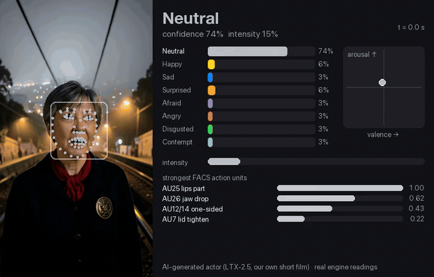
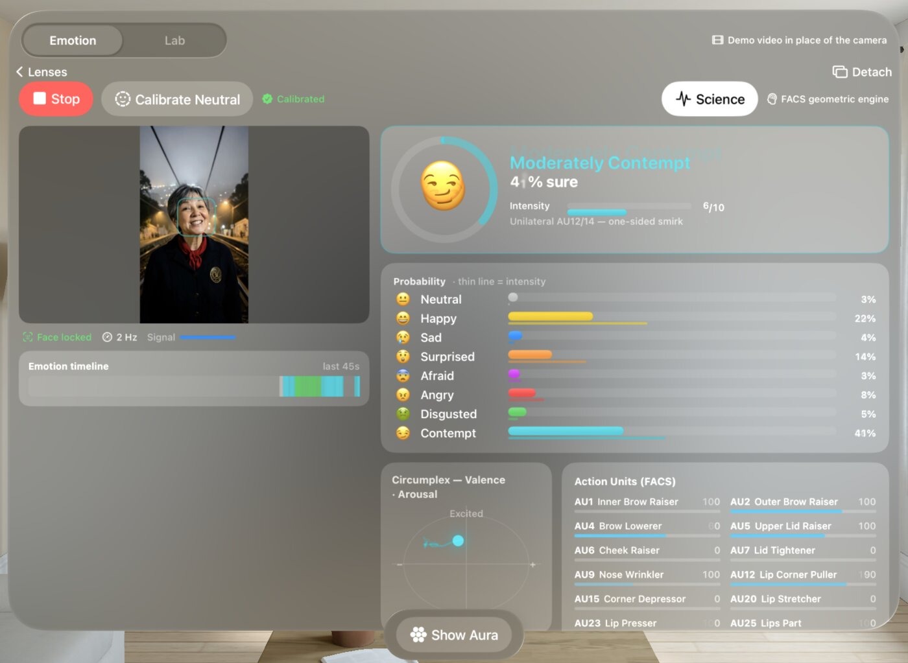
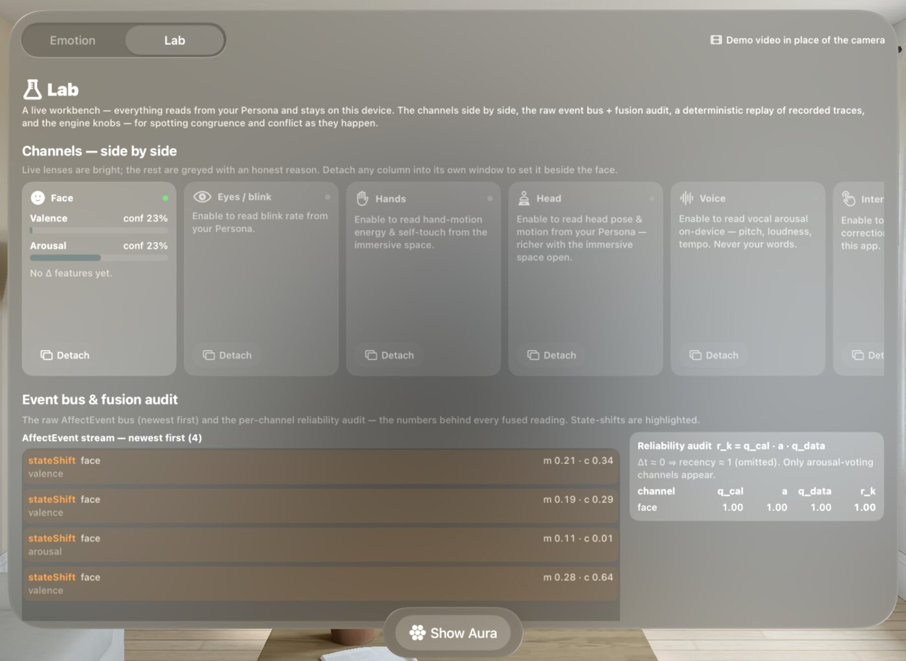
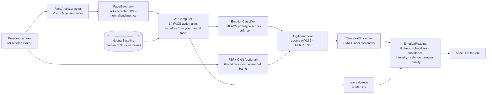
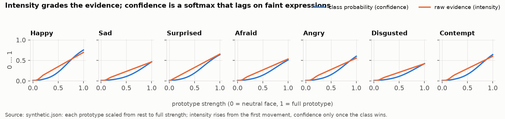
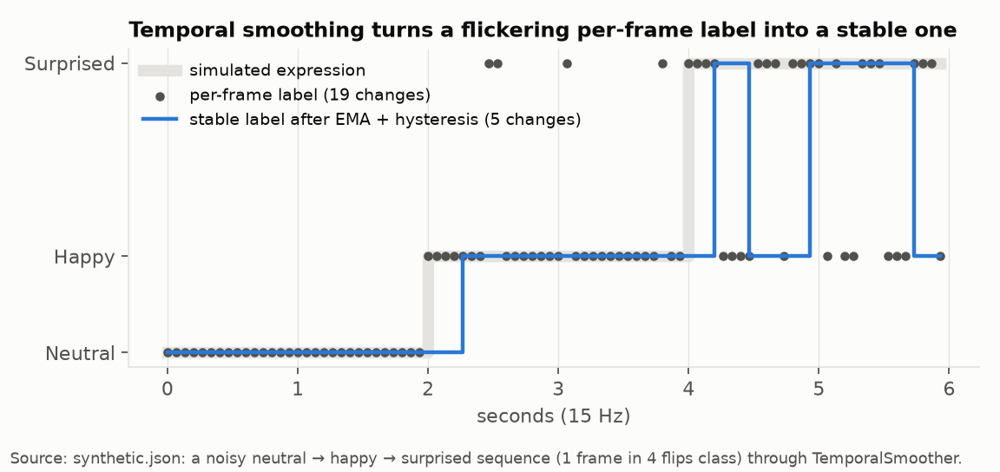
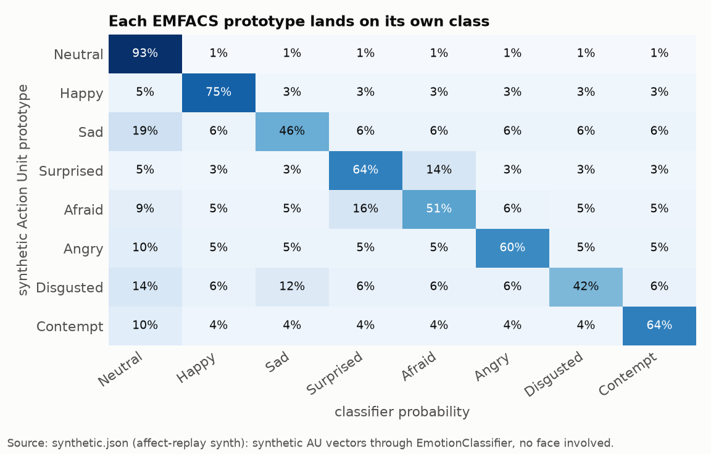
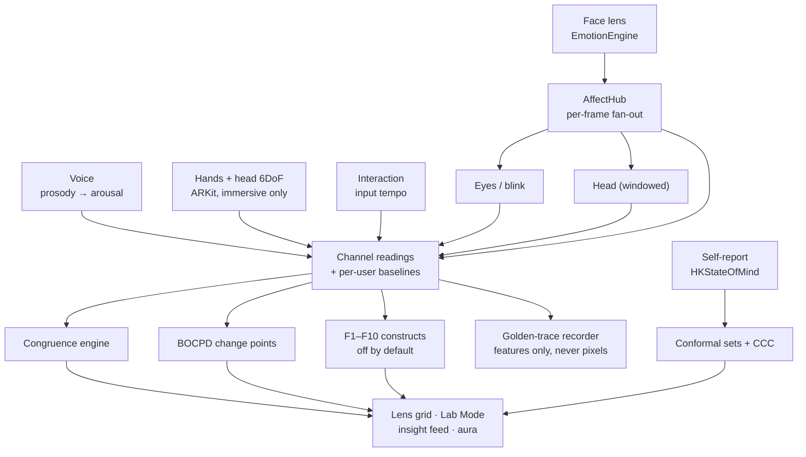

# AffectLens

**Real-time, on-device facial-expression and affect estimation for Apple Vision Pro, built on FACS.**

<p align="center">
  
</p>
<p align="center"><sub>The real engine, run on macOS over a clip of an <b>AI-generated actor</b> (LTX-2.5, from one of the author's own short films). No real person's face appears anywhere in this repo. Readings from <code>affect-replay run --calib-default --model FERPlus.mlpackage</code>; the overlay and dashboard are drawn by <code>tools/render_demo.py</code> from those readings.</sub></p>

AffectLens reads facial expression from the Vision Pro's front (Persona) camera and turns it into
an honest, explainable reading: eight emotion classes, how strongly the face is expressing
(intensity, kept separate from confidence), and where that sits on the valence/arousal circumplex.
It does this the way a FACS coder would: Apple's Vision face landmarks become 14 Facial Action Coding
System action units, measured against *your own* calibrated neutral face, scored against EMFACS
emotion prototypes, and fused with an optional FER+ neural network. Around that face engine sits a
multi-channel affect hub (eyes, head, voice, hands, interaction), ten opt-in fused constructs,
change-point detection, a self-report ground-truth loop through HealthKit's State of Mind, and a
Lab Mode for watching all of it think. Everything runs on the device; no frames are stored.

The engine is plain Swift over Vision and Core ML, so the same source files also compile on macOS
into `affect-replay`, a command-line tool that runs the real pipeline over video files. That is how
the demos here were made without anyone's real face.

> **Origin.** This started as a fork of [Ivan Campos's *Facial Computing*](https://github.com/IvanCampos/Facial-Computing),
> a visionOS sample that combines the Persona camera with the Vision framework. That project has no
> licence, so **none of its code is in this repository**: what you see here is the author's own emotion
> engine and everything built on it, plus a new, minimal visionOS app shell written from scratch.
> Thanks to Ivan Campos for the starting point; this project is not affiliated with or endorsed by
> him.

## Contents

- [See it run](#see-it-run)
- [How it works](#how-it-works)
- [What the engine measures](#what-the-engine-measures)
- [Beyond the face: the affect hub](#beyond-the-face-the-affect-hub)
- [Lab Mode](#lab-mode)
- [Tested how](#tested-how)
- [Requirements and setup](#requirements-and-setup)
- [Limitations](#limitations)
- [Privacy](#privacy)
- [Credits and licences](#credits-and-licences)

## See it run

**The real app UI in the visionOS simulator.** The simulator has no camera, so `-demo-video <file>`
makes the app's frame source play a video on a loop in real time; every frame goes through exactly
the live path (`CameraFeed` → `EmotionEngine.ingest` → hub fan-out).

<p align="center">
  
</p>
<p align="center"><sub>Face dashboard (visionOS 27 simulator, <code>-demo-video &lt;clip&gt; -open-lens face</code>), driven by the same AI-generated clip as above. Note the wrong answer: the simulator runs Vision on the CPU at about 2 Hz and auto-calibrated "neutral" on a face that was already laughing, so a smile reads as a one-sided smirk. That is the calibration rule below, failing visibly.</sub></p>

<p align="center">
  
</p>
<p align="center"><sub>Lab Mode (<code>-lab</code>): channel columns side by side, the raw AffectEvent bus with BOCPD state shifts, and the reliability audit behind every fused number.</sub></p>

**The engine on macOS.** `affect-replay` decodes a video, samples it at the app's 15 Hz cadence and
feeds each frame to `EmotionEngine.ingestOffline`, which is the live `ingest` minus the wall-clock
throttle, so a clip replays to the same readings every time. Vision and Core ML are pinned to the CPU.

```text
$ swift run -c release affect-replay run clip.mp4 --model Models/FERPlus.mlpackage --out readings.json
wrote readings.json        # per frame: dominant, confidence, intensity, valence, arousal, quality,
                           # fused + geometry-only + FER+ distributions, 14 AUs, head pose, landmarks
$ tools/render_demo.py readings.json clip.mp4 side-by-side.mp4
```

## How it works

Per frame, in `Sources/AffectEngine/EmotionEngine.swift`:



Two experts vote. The **geometric expert** is fully explainable: it knows *which* muscles moved. The
**appearance expert** is Microsoft's FER+ convolutional network, which sees texture the landmarks
miss (a nose wrinkle, a cheek bulge). They are fused as a weighted product of experts
(`p ∝ p_geo^0.65 · p_FER+^0.35`), which lets the network sharpen or veto the geometry without
overruling it. Without the model the engine runs geometry-only, a supported mode rather than a
failure. An optional dynamic weighting (`fusion.dynamicWeighting.enabled`) sets the FER+ weight per frame
from the geometry's own intensity and ambiguity and FER+'s confidence, and FER+ can be
temperature-scaled; both are off by default.

**Calibration is the accuracy pillar.** Faces differ: one person's resting brow is another's frown.
On the first good face the engine collects 36 frames and stores their median metrics as your
neutral baseline; every AU is then a *change* from that. It is re-runnable (*Calibrate Neutral*) and
slowly re-tracks during verified neutrality to absorb drift. Head pitch is corrected for too: looking
down foreshortens the brow and imitates AU4 (brow lowerer), so AU4 is discounted with pitch.

**Intensity and confidence are different signals.** Confidence is the fused probability of the
winning class. Intensity is the geometric expert's raw evidence: how hard the face is moving. A
faint, unmistakable smile is high confidence and low intensity; a big ambiguous grimace is the
reverse. The UI shows both.

<p align="center"></p>
<p align="center"><sub>Each EMFACS prototype scaled from rest to full strength through the real classifier (synthetic action units, no face; <code>affect-replay synth</code>, data in <code>docs/data/synthetic.json</code>, 2026-10-05).</sub></p>

**Temporal smoothing** keeps the label from flickering: an exponential moving average over the
distribution (α = 0.35), plus hysteresis: a challenger must lead the current label by 6 points for
3 consecutive updates before it replaces it.

<p align="center"></p>
<p align="center"><sub>A noisy synthetic sequence in which one frame in four flips class, through the real <code>TemporalSmoother</code>: 19 label changes per frame become 5. It still wavers during the noisiest stretch; that is the honest trade-off between lag and stability.</sub></p>

## What the engine measures

FACS (Ekman and Friesen) breaks any facial expression into **action units**, each one muscle or
muscle group. EMFACS is the subset of AU combinations that signal basic emotions. AffectLens
measures 14 AUs from the 2D landmarks:

| AU | Name | | AU | Name |
|---|---|---|---|---|
| 1 | inner brow raiser | | 12 | lip corner puller |
| 2 | outer brow raiser | | 15 | lip corner depressor |
| 4 | brow lowerer (pitch-corrected) | | 20 | lip stretcher |
| 5 | upper lid raiser | | 23 | lip tightener |
| 6 | cheek raiser | | 25 | lips part |
| 7 | lid tightener | | 26 | jaw drop |
| 9 | nose wrinkler | | 12/14 one-sided | the contempt smirk |

and scores them against EMFACS prototypes:

| Emotion | Prototype the classifier looks for |
|---|---|
| Happy | AU6 + AU12: cheek raise, lip corners up (the Duchenne smile) |
| Sad | AU1 + AU4 + AU15: inner brows up, corners down |
| Surprised | AU1 + AU2 + AU5 + AU26: brows up, eyes wide, jaw drop |
| Afraid | AU1 + AU2 + AU4 + AU5 + AU20: raised and knit brows, stretched lips |
| Angry | AU4 + AU5 + AU7 + AU23: lowered brows, tight lids and lips |
| Disgusted | AU9 + AU15: nose wrinkle, upper lip raise |
| Contempt | unilateral AU12/14: a one-sided smirk |
| Neutral | relaxed features, low expression energy |

<p align="center"></p>
<p align="center"><sub>Each prototype through the real classifier (synthetic action units; <code>docs/data/synthetic.json</code>). Every row peaks on its own class, but sadness and disgust only reach 46% and 42% and leak toward neutral and each other: these are the emotions the geometry alone finds hardest.</sub></p>

## Beyond the face: the affect hub

`AffectHub` is the composition root. It owns the face engine and five more **channels**, each with its
own per-user baseline, and every one of them except the face is **off by default**:

| Channel | Signal | Source |
|---|---|---|
| Eyes / blink | blink rate, eye openness (adaptive EAR): attention and fatigue, never "emotion" | the face analysis fan-out |
| Head | pitch / yaw / roll from the window, full 6DoF in the immersive space | Vision pose, ARKit device anchor |
| Voice | prosody to arousal: pitch, loudness, tempo; on-device, **no speech recognition** | microphone, SoundAnalysis |
| Hands | motion energy and self-touch rate; **no gesture dictionary** | ARKit hand tracking (immersive space only) |
| Interaction | input tempo and corrections, a zero-permission effort signal | SwiftUI spatial events |

On top of the channels:

- **Congruence engine.** Do the channels agree? Reliability-weighted sign consensus on the shared
  arousal axis plus windowed synchrony. Disagreement becomes a *named* state that is never averaged
  away (and never called "concealment").
- **Ten fused constructs (F1 to F10)**, each a toggle, each named after the psychology it models and
  each showing its reasoning: Composure under load, Cognitive load, Fatigue ⇄ Engagement,
  Frown + head-down (a disambiguation ladder: is that a frown, or is the head just tilted?),
  Corroborated arousal, Corroborated positivity, Frustration, Dominance display, Expansive display,
  Approach ⇄ Withdrawal.
- **Change points.** Bayesian online change-point detection (Adams and MacKay 2007) on valence and
  arousal raises `stateShift` events, which drive a template narrator ("a change in the reading, not
  a claim about how you feel") and the insight feed.
- **Ground truth from the wearer.** A rare one-tap "How do you feel?" self-report is stored locally
  and, if allowed, written to Apple Health as an `HKStateOfMind` sample. Each report snapshots the
  inferred reading, which feeds a per-user concordance (Lin's CCC) and **split-conformal prediction
  sets** (APS): "likely {Happy, Surprised}" with a coverage guarantee *for this user*, instead of a
  falsely certain top-1 label.
- **Uncertainty grammar in the UI**: value-suppressing palettes, quantile dot plots, forked meters,
  multi-label chips.
- **Thermal governor**: sheds the FER+ inference and slows polling as the device warms.
- **Optional emotion aura**: a mixed-immersion sphere that tints the real room with the reading.



## Lab Mode

The on-device workbench for developing all of the above: every channel side by side (raw, derived,
interpreted), detachable into their own windows; the raw `AffectEvent` stream next to the
per-channel reliability audit (`r_k = q_cal · a · q_data`); a **golden-trace recorder** that writes
features and events (never pixels) to JSONL; a **replay scrubber** that pushes a recorded trace back
through the whole pipeline deterministically; an **A/B replay** that re-fuses the same recorded
evidence under different weights or thresholds; and the self-report ground-truth view.

## Tested how

There is no XCTest target. The regression guard is `EmotionSelfTests.runAll()`: 717 assertions (662 `assert` and 55 `assertionFailure` call sites) over
the classifier prototypes, hysteresis, intensity grading, AU4 pitch correction, the ten fusion
constructs, congruence, change points, golden-trace replay (including a check that the trace
schema has no pixel fields), conformal coverage and CCC, prosody, hand and head kinematics, the
thermal policy, and a lint that bans overclaiming phrases from every user-facing string. The app runs
it at launch in debug builds and traps on failure. Because the engine compiles on macOS, it also runs
from the command line:

```text
$ swift run affect-replay selftest
   • US-E17 conformal coverage on 200 held-out draws: 1.0 (target ≥ 0.9)
   • US-lab replay A/B: congruence breaks A=1 vs B=0; mlWeight fixed(0)→anger vs fixed(1)→happiness
✅ EmotionSelfTests: all checks passed
```

## Requirements and setup

- **App:** Xcode 26 or later with the visionOS 26 SDK, Apple Vision Pro (or the visionOS simulator,
  with a demo video in place of the camera), [XcodeGen](https://github.com/yonaskolb/XcodeGen).
  Hands, 6DoF head and voice need a device.
- **Engine tool:** macOS 26 or later on Apple Silicon, Swift 6.2 toolchain. `affect-replay` runs on
  the CPU; a 5-second clip takes a few seconds.
- **Demo tools:** `ffmpeg`, and [`uv`](https://docs.astral.sh/uv/) for the Python scripts (they
  declare their own dependencies).

```sh
# 1. Optional: build the FER+ appearance expert (not shipped, see licences below)
tools/fetch_ferplus.sh                   # → Models/FERPlus.mlpackage

# 2. The visionOS app
export DEVELOPMENT_TEAM=YOUR_TEAM_ID     # only needed for a device
xcodegen generate && open AffectLens.xcodeproj
#   simulator without a camera: add launch arguments  -demo-video /path/to/clip.mp4  [-open-lens face | -lab]

# 3. The engine on macOS
swift run affect-replay selftest
swift run -c release affect-replay run clip.mp4 --model Models/FERPlus.mlpackage --out readings.json
swift run -c release affect-replay synth --out synthetic.json
tools/render_demo.py readings.json clip.mp4 side-by-side.mp4
tools/run_demo.sh <folder of emotion-named clips> <out dir>   # score, charts and videos in one go
```

Layout: `Sources/AffectEngine/` the engine (49 files, ~18.5k lines including the self-tests),
`Sources/AffectUI/` the SwiftUI views, `App/` the visionOS shell (window, camera feed, aura space),
`Sources/Harness/` the macOS tool, `tools/` conversion, rendering, scoring and charts,
`docs/design/` the research notes, PRDs and on-device run sheet behind the multi-channel work.

## Limitations

- **Intended use: the wearer's own face, for self-reflection and research.** The app reads only the
  Persona of the person wearing the headset. It is not designed or validated for judging other people,
  and must not be used for hiring, education, security, surveillance or any decision about a person.
- **This is not an emotion detector in the sense of knowing how someone feels.** It reads facial
  *expression*, which people control, mask and perform; the UI copy is linted to say so.
- **2D landmarks only.** Vision gives 2D points, not a 3D mesh or blendshapes, so AUs are estimated
  from geometry: subtle AUs (AU7, AU23) and anything the landmarks don't cover (AU9's nose wrinkle,
  mostly) are weak, which is part of why the FER+ expert exists.
- **The Persona is not your face.** On Vision Pro the front camera shows your *Persona*, Apple's
  rendered avatar, so the engine reads the avatar's re-rendering of your expression. How faithfully
  fine signals (blink aperture, gaze) survive that is an open on-device question; see
  `docs/design/keystone-run-sheet.md`.
- **Calibration matters.** Calibrating on a face that is not neutral skews every reading (the
  simulator screenshot above shows exactly that).
- **No population accuracy claim.** There is no labelled benchmark of Persona video. The conformal
  sets are per-user, and only once the user has given enough self-reports.
- **FER+ is a 2016-era model** trained on 48×48 grayscale web images; it is optional for a reason.
- **The simulator** runs Vision on the CPU at about 2 Hz and reports zero landmark confidence on most
  frames, so in the simulator only the engine falls back to the detector's face confidence
  (`FaceAnalyzer.swift`). Treat simulator readings as a UI demo.
- The visionOS shell here is deliberately minimal: the window, the camera feed, the aura space.

## Privacy

Frames are analysed in memory and dropped. Golden traces and self-reports hold features and events
only, never pixels (a self-test enforces the trace schema). Voice is reduced to prosody with no speech
recognition, so no words can be transcribed. Hands are reduced to motion energy with no gesture
dictionary. HealthKit access is optional and write-only; a State of Mind sample, once saved, follows
the user's own Health and iCloud settings like any other Health data. Apart from that, nothing leaves
the device.

## Credits and licences

- **AffectLens code**: MIT, see [`LICENSE`](LICENSE).
- **Origin**: forked from [Ivan Campos's Facial Computing](https://github.com/IvanCampos/Facial-Computing)
  (no licence; none of its code is included here).
- **FER+ model**: Microsoft's FER+ (Barsoum et al., 2016, [arXiv:1608.01041](https://arxiv.org/abs/1608.01041)),
  as `emotion-ferplus-8` from the [ONNX Model Zoo](https://github.com/onnx/models/tree/main/validated/vision/body_analysis/emotion_ferplus),
  MIT per its model card. **Not redistributed here**: the weights were trained on the FER2013 images
  (Kaggle ICML 2013 challenge), whose redistribution terms are unclear. `tools/fetch_ferplus.sh`
  downloads and converts it locally (`tools/convert_ferplus.py`).
- **Apple frameworks**: Vision, Core ML, ARKit, AVFoundation, SoundAnalysis, HealthKit, RealityKit.
- **AI-generated footage**: every face in `docs/media/` is AI-generated with LTX-2.5 (Lightricks,
  LTX-2 Community License) on a local Mac. No real person appears, and none of the media is derived
  from a real person's image.
- **Science** the design draws on: Ekman and Friesen's FACS and EMFACS; Russell's circumplex;
  Adams and MacKay (2007) for BOCPD; Angelopoulos and Bates for conformal prediction; Lin's
  concordance correlation coefficient; Correll, Moritz and Heer (2018) for value-suppressing
  uncertainty palettes; Kay, Kola, Hullman and Munson (2016) for quantile dot plots. Citations for the
  rest are in `docs/design/`.
